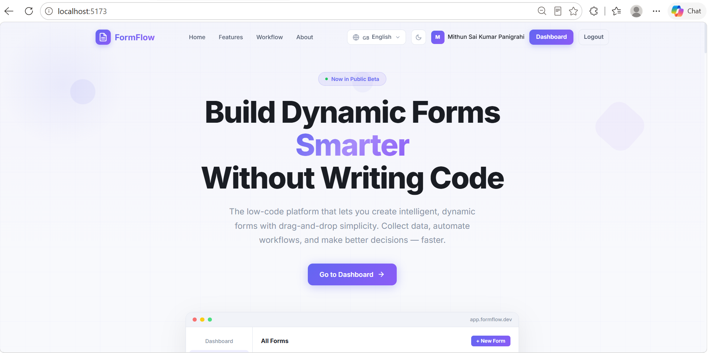
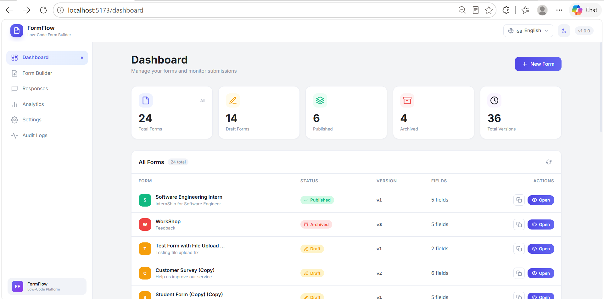
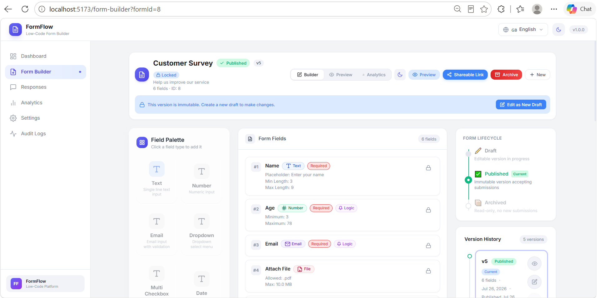
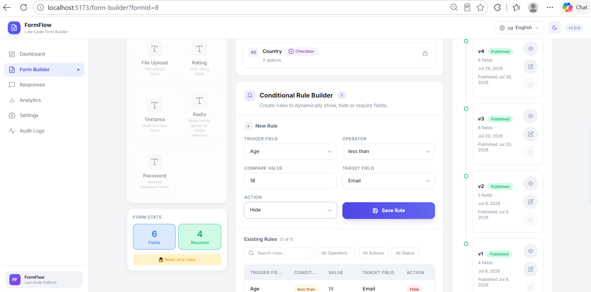
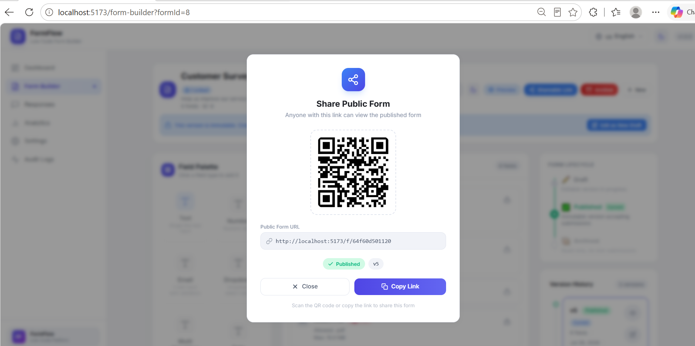
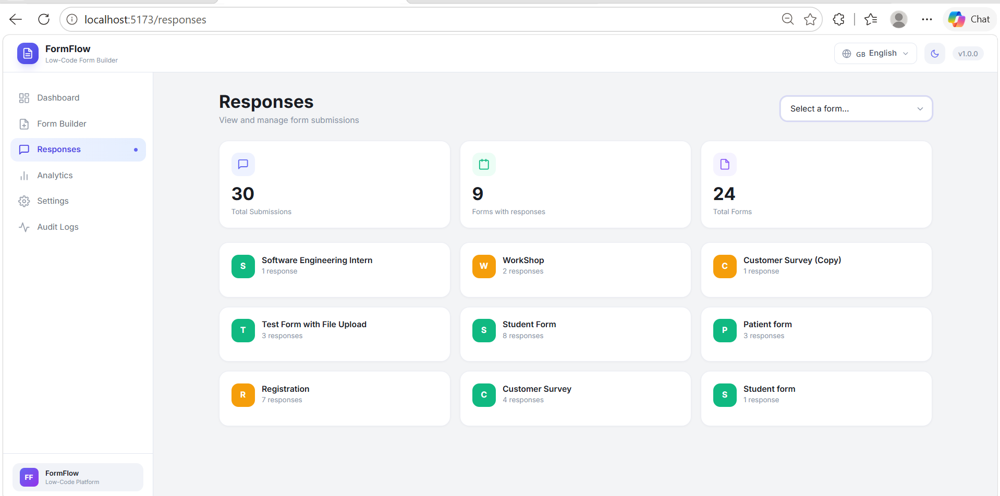
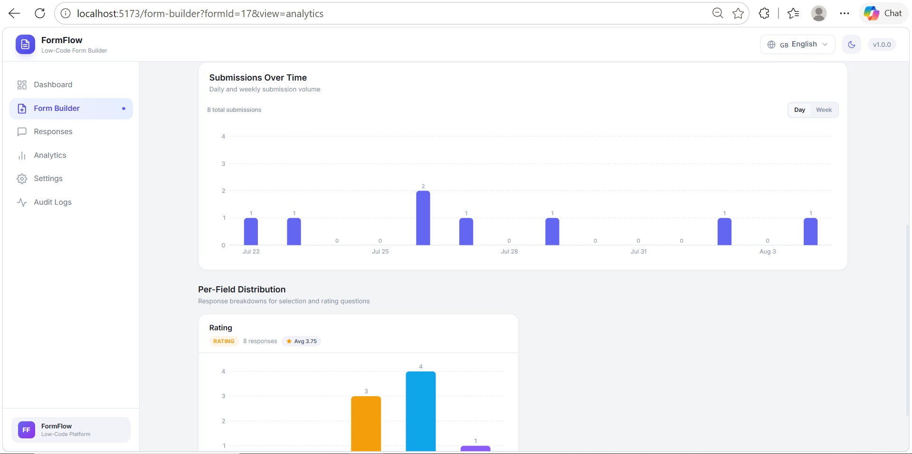
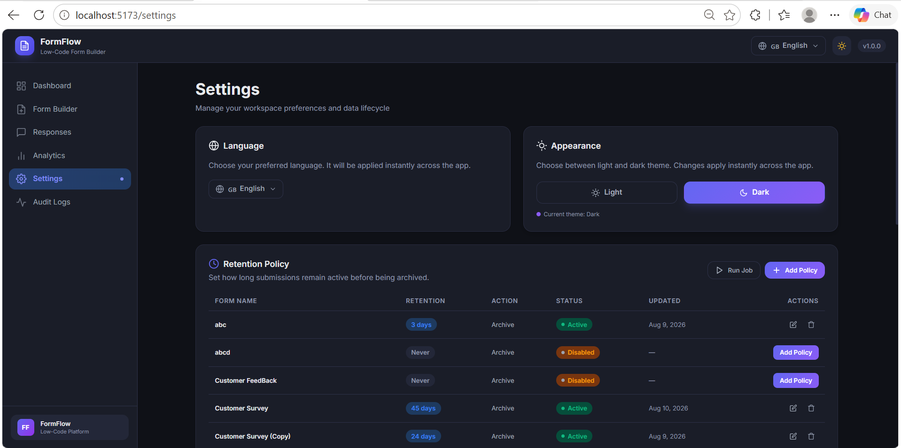
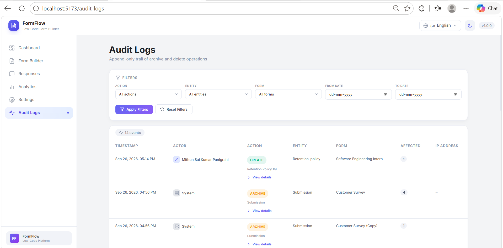
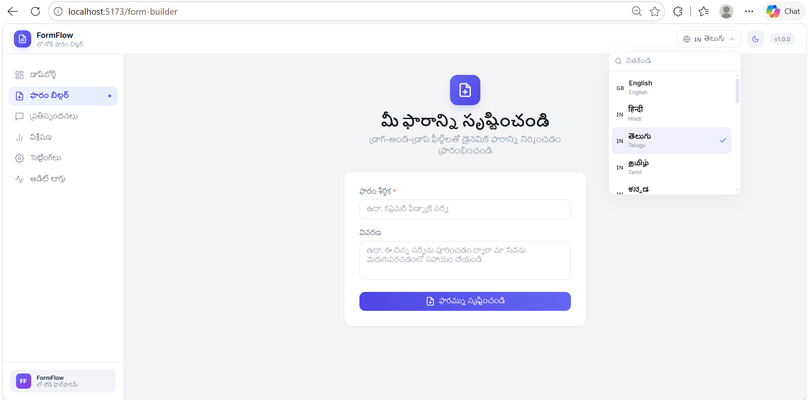

<div align="center">

# Low-Code Dynamic Form Workflow & Data Collection Platform

### Build dynamic forms, collect responses, and manage the complete form workflow from one platform.

A full-stack low-code platform that allows administrators to create configurable forms, apply validation and conditional logic, publish shareable forms, collect responses, analyze submissions, and manage form data through an intuitive web interface.


</div>

---

## Overview

The **Low-Code Dynamic Form Workflow & Data Collection Platform** is a full-stack web application designed to make form creation and data collection configurable instead of hard-coded.

The platform provides an administrative environment where users can create forms, configure fields, define validation rules, build conditional workflows, manage form versions, and publish forms through shareable URLs.

Respondents can access published forms through public links and submit their responses. Administrators can then browse, search, filter, and inspect responses, view analytics, export collected data, and manage the lifecycle of forms and submissions.

The platform also includes form duplication, Read-Only Mode, Edit as New Draft, response retention policies, bulk deletion, audit logs, multilingual support, and light/dark themes.

---

## Screenshots

The following screenshots are presented in the same order as the application's workflow, starting with the public introduction page and continuing through the main administrative features.

### 1. Interface — Project Introduction

The **Interface** is the starting page of the application before a user logs in. It introduces the purpose of the platform and provides the entry point to the application.



---

### 2. Dashboard

After entering the application, the **Dashboard** provides the central workspace for managing forms and accessing the platform's main functionality.



---

### 3. Form Builder

The **Form Builder** allows administrators to create dynamic forms, add fields, configure field properties, and build the structure of a form.



---

### 4. Conditional Rule Builder

The **Conditional Rule Builder** allows administrators to define rules that dynamically control the visibility and behavior of fields based on respondent input.



---

### 5. Shareable Link

Once a form is published, the platform provides a **Shareable Link** that can be used by respondents to access the public form.



---

### 6. Responses

The **Responses** section allows administrators to browse submitted responses, search and filter collected data, and inspect individual submissions.



---

### 7. Analytics

The **Analytics** section provides submission statistics and field-level response distributions to help administrators understand the collected data.



---

### 8. Settings

The **Settings** section provides application-level preferences, including interface-related configuration and theme options.



---

### 9. Audit Logs

The **Audit Logs** section records relevant administrative activities and provides an interface for reviewing those recorded actions.



---

### 10. Multilingual Support

The platform includes **multilingual support**, allowing the interface and public form experience to be presented in supported languages.



---

## Core Features

### Dynamic Form Builder

- Create forms through a visual form-building interface.
- Support **8 field types**.
- Add, edit, and manage fields.
- Configure field properties.
- Configure required fields and validation constraints.
- Save forms as drafts before publishing.

### Conditional Logic

The platform supports dynamic conditional rules that can control field visibility based on respondent input.

Supported operators include:

- `equals`
- `not_equals`
- `contains`
- `greater_than`
- `less_than`

Conditional rules are applied in the public form experience and are also re-evaluated during server-side submission processing.

### Validation

Validation is handled on both the frontend and backend.

- Client-side validation provides immediate feedback to respondents.
- Server-side validation verifies submitted data before it is stored.
- Field-specific validation rules can be configured from the form builder.

### Form Versioning

Forms are managed through a version-based lifecycle:

```text
Draft
  |
  v
Publish
  |
  v
Archive
```

The platform supports:

- Draft creation
- Publishing
- Archived versions
- Version history
- Editing a published form as a new draft
- Preserving the existing published version while preparing changes

### Public Forms and Shareable URLs

- Generate a public URL for a published form.
- Allow respondents to access the form without entering the administrative interface.
- Render configured fields and conditional logic dynamically.
- Validate and submit responses through the public form.

### Response Management

Administrators can:

- Browse submitted responses.
- Search responses.
- Filter responses.
- Open individual response details.
- View response identifiers.
- Manage collected response data.
- Handle file-upload responses.

### File Uploads

Forms can include file-upload fields.

The backend handles uploaded files separately from structured response data and provides controlled access to stored files.

### Idempotent Submissions

The submission workflow includes idempotency support to help prevent duplicate processing when the same submission request is repeated.

### Analytics

The analytics functionality provides:

- Form submission statistics.
- Response insights.
- Field-level response distributions.
- Visual charts for collected data.

### CSV and JSON Export

Collected responses can be exported in:

- **CSV**
- **JSON**

This allows administrators to use collected form data outside the application when required.

### Form Duplication

An existing form can be duplicated to create a new draft while reusing its form structure.

### Read-Only Mode

**Read-Only Mode** allows an existing form to be viewed without making changes to its configuration.

### Edit as New Draft

**Edit as New Draft** creates a separate draft from an existing form so that modifications can be made without directly changing the existing published version.

### Search and Filtering

The form-management interface provides search and filtering capabilities to quickly locate required forms.

### Response Retention

Administrators can configure response-retention policies for forms and manage stored responses according to the configured retention workflow.

### Bulk Response Deletion

The platform provides bulk deletion functionality for managing multiple stored responses.

### Audit Logging

Administrative actions are recorded in audit logs, providing a history that can be reviewed from the administration interface.

### Multilingual Support

The application supports a multilingual interface and localized public-form experiences.

### Light and Dark Themes

The application supports both light and dark interface themes.

---

## Application Workflow

```text
                    APPLICATION
                         |
                         v
                 Project Interface
                         |
                         v
                      Login
                         |
                         v
                    Dashboard
                         |
                         v
                  Create a Form
                         |
                         v
                 Add Field Types
                         |
                         v
            Configure Validation Rules
                         |
                         v
             Configure Conditional Rules
                         |
                         v
                    Save Draft
                         |
                         v
                     Publish
                         |
                         v
              Generate Shareable URL
                         |
                         v
                  Public Form
                         |
                         v
              Respondent Submission
                         |
                         v
             Client-side Validation
                         |
                         v
             Server-side Validation
                         |
                         v
              Store Form Response
                         |
                         v
       +-----------------+-----------------+
       |                 |                 |
       v                 v                 v
   Responses          Analytics          Export
       |
       v
 Retention / Bulk
   Management
```

---

## Technology Stack

### Backend

| Technology | Purpose |
|---|---|
| **Python** | Backend programming language |
| **FastAPI** | REST API framework |
| **PostgreSQL** | Relational database |
| **SQLAlchemy** | Object-relational mapping and database interaction |
| **Alembic** | Database schema migrations |
| **Pydantic** | Request and response validation |
| **python-multipart** | Multipart and file-upload handling |

### Frontend

| Technology | Purpose |
|---|---|
| **React** | Frontend UI library |
| **Vite** | Development server and build tool |
| **React Router** | Client-side routing |
| **Axios** | Frontend API communication |
| **Recharts** | Analytics visualization |
| **CSS** | Application styling |

### Development and Documentation

| Tool | Purpose |
|---|---|
| **Git** | Version control |
| **GitHub** | Source-code hosting |
| **Docker Compose** | Optional containerized setup |
| **Swagger UI** | Interactive API documentation |
| **ReDoc** | API documentation |

---

## Architecture

The platform follows a frontend-backend-database architecture.

```text
+--------------------------------------+
|             React Frontend           |
|                                      |
| Interface                            |
| Dashboard                            |
| Form Builder                         |
| Conditional Rule Builder             |
| Responses                            |
| Analytics                            |
| Settings                             |
| Public Forms                         |
+-------------------+------------------+
                    |
                    | HTTP / REST APIs
                    v
+--------------------------------------+
|             FastAPI Backend          |
|                                      |
| Routers                              |
| Schemas                              |
| Services                             |
| Validation                           |
| Form Workflow                        |
| Submission Handling                  |
| Analytics                            |
| Export                               |
| Retention                            |
| Audit Logging                        |
+-------------------+------------------+
                    |
                    | SQLAlchemy
                    v
+--------------------------------------+
|              PostgreSQL              |
|                                      |
| Forms                                |
| Form Versions                        |
| Fields                               |
| Conditional Rules                    |
| Submissions / Responses              |
| Administrative Data                  |
+--------------------------------------+
```

The frontend communicates with the FastAPI backend through REST APIs. The backend handles application logic and database operations, while PostgreSQL provides persistent storage. SQLAlchemy is used for database interaction and Alembic manages schema migrations.

---

## Project Structure

```text
Dynamic-Form-Workflow/
│
├── backend/
│   ├── app/
│   │   ├── config/
│   │   ├── database/
│   │   ├── models/
│   │   ├── routers/
│   │   ├── schemas/
│   │   ├── services/
│   │   └── main.py
│   │
│   ├── alembic/
│   │   └── versions/
│   │
│   ├── tests/
│   ├── scripts/
│   ├── uploads/
│   ├── Dockerfile
│   └── requirements.txt
│
├── frontend/
│   ├── src/
│   │   ├── components/
│   │   ├── hooks/
│   │   ├── layouts/
│   │   ├── pages/
│   │   └── services/
│   │
│   ├── Dockerfile
│   ├── package.json
│   └── vite.config.js
│
├── scripts/
│   ├── i18n maintenance scripts
│   └── translations/
│
├── screenshots/
│   ├── interface.png
│   ├── dashboard.png
│   ├── formbuilder.png
│   ├── conditionalrulebuilder.png
│   ├── sharelink.png
│   ├── responses.png
│   ├── analytics.png
│   ├── settings.png
│   ├── auditlogs.png
│   └── multilingual.png
│
├── docker-compose.yml
├── .gitignore
└── README.md
```

---

## API Overview

The FastAPI backend provides REST APIs for the major application workflows.

| API Area | Purpose |
|---|---|
| **Forms** | Create and manage forms |
| **Fields** | Add, update, delete, and manage form fields |
| **Versions** | Manage drafts, publishing, archiving, and version history |
| **Conditional Rules** | Create and manage conditional rules |
| **Public Forms** | Access published forms through public links |
| **Submissions** | Validate and submit responses |
| **Responses** | Browse and inspect submitted responses |
| **File Uploads** | Handle files submitted through forms |
| **Analytics** | Retrieve form and field-level analytics |
| **Exports** | Export response data as CSV and JSON |
| **Retention** | Manage response-retention configuration |
| **Audit Logs** | Record and review administrative activity |
| **Health** | Check backend service availability |

### Interactive API Documentation

When the backend is running:

```text
Swagger UI
http://localhost:8000/docs

ReDoc
http://localhost:8000/redoc
```

---

## Getting Started

The project can be run locally without Docker.

### Prerequisites

- Python
- Node.js and npm
- PostgreSQL
- Git

Docker is optional.

### 1. Clone the Repository

```bash
git clone <YOUR_GITHUB_REPOSITORY_URL>
cd <YOUR_REPOSITORY_DIRECTORY>
```

### 2. Configure PostgreSQL

Create a PostgreSQL database for the project, for example:

```text
dynamic_forms_db
```

Configure the backend environment variables with your local PostgreSQL connection details and required application settings.

> Do not commit passwords, secret keys, or other private environment values to Git.

### 3. Set Up the Backend

From the repository root:

```bash
cd backend
```

Create a virtual environment:

```bash
python -m venv venv
```

#### Windows PowerShell

```powershell
.\venv\Scripts\Activate.ps1
```

#### Windows Command Prompt

```bat
venv\Scripts\activate.bat
```

#### macOS / Linux

```bash
source venv/bin/activate
```

Install the backend dependencies:

```bash
pip install -r requirements.txt
```

Run the database migrations:

```bash
alembic upgrade head
```

Start the FastAPI server:

```bash
uvicorn app.main:app --reload
```

The backend will normally run at:

```text
http://localhost:8000
```

### 4. Set Up the Frontend

Open a second terminal from the repository root:

```bash
cd frontend
```

Install dependencies:

```bash
npm install
```

Start the development server:

```bash
npm run dev
```

The frontend will normally run at:

```text
http://localhost:5173
```

Use the URL displayed by Vite if the development server selects a different port.

---

## Docker Setup

Docker is optional.

The repository includes a `docker-compose.yml` file for running the application's services using Docker Compose.

From the project root:

```bash
docker compose build
docker compose up -d
```

To stop the services:

```bash
docker compose down
```

The Compose configuration contains the PostgreSQL database, FastAPI backend, and React frontend services.

---

## Data Handling

The application stores structured form and response data in PostgreSQL.

Uploaded files are handled separately from structured response data. The backend provides controlled file handling and protected access to uploaded files.

The runtime upload directory is excluded from Git so that uploaded user files are not committed to the repository.

---

## Project Goal

The goal of this project is to provide a reusable low-code platform for creating data-collection workflows without requiring a separate hard-coded form implementation for every requirement.

Instead of:

```text
Requirement
    ↓
Build a new form in code
    ↓
Deploy changes
```

the platform provides:

```text
Create / Configure Form
          ↓
     Add Rules
          ↓
       Publish
          ↓
   Collect Responses
          ↓
 Manage / Analyze Data
```

This approach makes the form structure, validation, conditional behavior, and response-management workflow configurable through the application.

---

## Author

**Mithun Sai Kumar Panigrahi**

B.Tech — Computer Science and Engineering

GitHub: [@msk-panigrahi](https://github.com/msk-panigrahi)

---

<div align="center">

### Low-Code Dynamic Form Workflow & Data Collection Platform

**Build Forms • Configure Workflows • Collect Responses • Manage Data**

</div>
